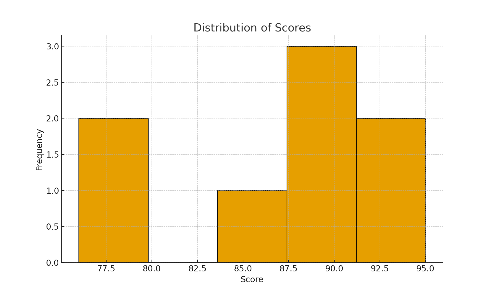
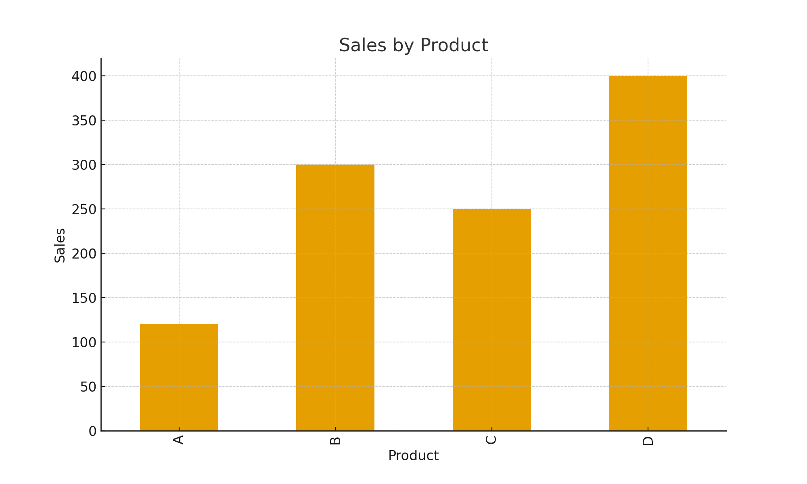

# IBM Data Analyst Professional Certificate - Project Outputs

This file contains the **outputs** of selected projects (without showing code).  
All charts are embedded and visible directly in GitHub.

---

## Project 1: Data Cleaning

**Original DataFrame:**

| Name    | Age  | City      |
|---------|------|-----------|
| Alice   | 25   | Delhi     |
| Bob     | 30   | Mumbai    |
| Charlie | NaN  | Bangalore |
| Alice   | 25   | Delhi     |
| None    | 22   | Chennai   |

**Cleaned DataFrame (NaN + duplicates removed):**

| Name  | Age  | City    |
|-------|------|---------|
| Alice | 25   | Delhi   |
| Bob   | 30   | Mumbai  |
| None  | 22   | Chennai |

---

## Project 2: Exploratory Data Analysis

**Summary Statistics:**

|       | Score   |
|-------|---------|
| count | 8.000000 |
| mean  | 86.625000 |
| std   | 6.543707 |
| min   | 76.000000 |
| 25%   | 82.750000 |
| 50%   | 88.500000 |
| 75%   | 90.750000 |
| max   | 95.000000 |

**Distribution of Scores:**  

---

## Project 3: Data Visualization

**Sales Data:**

| Product | Sales |
|---------|-------|
| A       | 120   |
| B       | 300   |
| C       | 250   |
| D       | 400   |

**Sales by Product:**  

---

## Project 4: Correlation Analysis

**Dataset:**

| Hours_Studied | Exam_Score |
|---------------|------------|
| 1             | 50         |
| 2             | 55         |
| 3             | 65         |
| 4             | 70         |
| 5             | 75         |
| 6             | 80         |
| 7             | 90         |

**Correlation Matrix:**

|               | Hours_Studied | Exam_Score |
|---------------|---------------|------------|
| Hours_Studied | 1.000000      | 0.991241   |
| Exam_Score    | 0.991241      | 1.000000   |

---

## Project 5: Simple Linear Regression

**Prediction:**  
Predicted exam score for 8 study hours: **95.36**

---

✅ These outputs were generated as part of the IBM Data Analyst Professional Certificate projects.  
